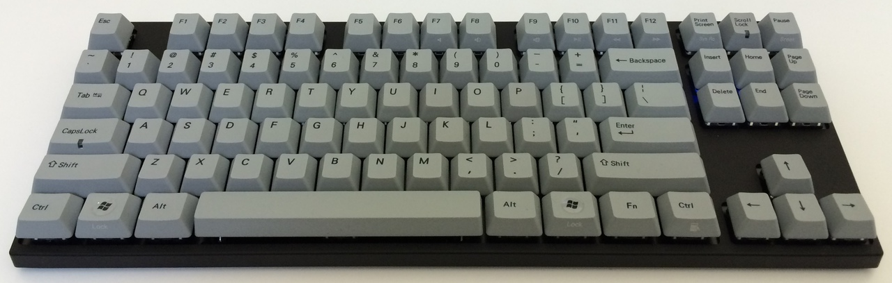
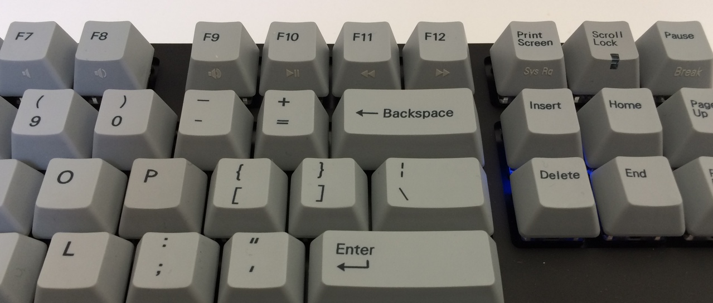

WASD keycaps for Varmilo VB87M keyboard
=======================================

This is a
[WASD Keyboards custom layout](wasd-vb87m-layout.svg)
for an
[87 key Cherry MX keycap set from WASD Keyboards,](http://www.wasdkeyboards.com/index.php/products/keycap-set/87-key-cherry-mx-keycap-set.html)
optimized for the Varmilo VB87M Bluetooth keyboard, one of the few
mechanical keyboards that is also wireless.

Description
-----------

The Varmilo VB87M is one of the rare keyboards that offers both
mechanical key switches as well as wireless connectivity, and one of the
even rarer ones that is nominally Mac compatible. It can periodically be
[purchased through Massdrop](https://www.massdrop.com/buy/varmilo-vb87m-bluetooth)
for around USD $130.

The model I ordered is black, with Gateron Brown switches and light
grey, top-printed dye sub keycaps:

The keyboard has some problems in the look and feel department:

* Default keycap color options are highly conspicuous (grey, white, or green).
* All of the mechanical switch options are quite loud.
* Classic PC layout has a Windows key, <kbd>Alt</kbd>, and so on, non-ideal for Mac usage.
* Raised bumps on <kbd>F</kbd> and <kbd>J</kbd> are a bit too small.

A replacement keycap set from
[WASD Keyboards](http://www.wasdkeyboards.com/)
can address all of these problems: keys are available in black or dark
grey, with o-rings to slightly dampen key click, and in a Mac layout.
The raised bumps on <kbd>F</kbd> and <kbd>J</kbd> are more noticeable
than those on the keys that ship with the Varmilo VB87M.

WASD Keyboards also offers a
[Mac hotkey shortcuts keycap set](http://www.wasdkeyboards.com/index.php/products/keycap-mod-packs/mac-hotkey-shortcuts-cherry-mx-keycap-set.html)
for normal Mac keyboards; however, the media keys on the Varmilo VB87M
are slightly astandard:

* <kbd>Fn</kbd>+<kbd>F7</kbd> = Mute
* <kbd>Fn</kbd>+<kbd>F8</kbd> = Volume Up
* <kbd>Fn</kbd>+<kbd>F9</kbd> = Volume Down
* <kbd>Fn</kbd>+<kbd>F10</kbd> = Play/Pause
* <kbd>Fn</kbd>+<kbd>F11</kbd> = Rewind/Previous Track
* <kbd>Fn</kbd>+<kbd>F12</kbd> = Fast Forward/Next Track
* <kbd>Print Screen</kbd> = <kbd>F13</kbd>
* <kbd>Scroll Lock</kbd> = Brightness Down (does _not_ register as <kbd>F14</kbd>)
* <kbd>Pause</kbd> = Brightness Up (does _not_ register as <kbd>F15</kbd>)

Finally, there are a few keyboard-specific shortcuts, most usefully:

* <kbd>Fn</kbd>+<kbd>Insert</kbd> = Toggle keyboard power
* <kbd>Fn</kbd>+<kbd>→</kbd> = Enter Bluetooth pairing mode

WASD Keyboards allows customers to upload a
[custom layout file](http://support.wasdkeyboards.com/customer/portal/articles/1518370-creating-a-custom-layout)
when ordering a set of keycaps. This repository contains a custom layout
that puts the media keys in the correct spots for the Varmilo VB87M,
adds power and Bluetooth icons for the keyboard-specific shortcuts.
changes <kbd>caps lock</kbd> to <kbd>control</kbd>, and uses uppercase
for the function keys (<kbd>F1</kbd> instead of <kbd>f1</kbd>).

Install
-------

WASD Keyboards custom layouts are SVG files, and they recommend using
[Inkscape](https://inkscape.org/) to edit them. Local copies of open
source installation files:

* [Inkscape](install/Inkscape-0.91-1-x11-10.7-x86_64.dmg) (GPLv2)
* [XQuartz](install/XQuartz-2.7.8.dmg) (APSL)

If you want to edit any of the Mac layout keycap text, you will also
need the proprietary
[VAG Rounded Light](http://www.linotype.com/1562959/vag-rounded-light-product.html)
font, at 9pt.

Related openly licensed media:

* [Bluetooth icon vector graphic](Bluetooth_white_tray_icon.svg) (public domain, from [Wikipedia source](https://en.wikipedia.org/wiki/File:Bluetooth_white_tray_icon.svg))
* [WASD Keyboard layout template](wasd-inkscape-104-10.23.2015.svg) (license unspecified, from [WASD custom layout template file download page](http://support.wasdkeyboards.com/customer/portal/kb_article_attachments/67914/original.svg?1445632730))

Changes
-------

On `Mac` layer:

* Replace function keys with uppercase variants
* Remove <kbd>F14</kbd> and <kbd>F15</kbd>
* Change <kbd>caps lock</kbd> to <kbd>control</kbd>

On `Mods - Media Keys` layer:

* Add mute icon to <kbd>F7</kbd>
* Add play/pause icon to <kbd>F10</kbd>
* Add fast forward/next track icon to <kbd>F11</kbd>
* Add rewind/previous track icon to <kbd>F12</kbd>

On `Stock Artwork` layer:

* Add volume down icon to <kbd>F8</kbd>
* Add volume up icon to <kbd>F9</kbd>
* Add brightness down icon to former <kbd>F14</kbd>
* Add brightness up icon to former <kbd>F15</kbd>
* Add power icon to <kbd>insert</kbd>

Add new `Bluetooth Icon` layer:

* Add Bluetooth icon (foreground only, stroked to black) to <kbd>→</kbd>

Icons are scaled to match mute icon height (7.998px) as reference.
